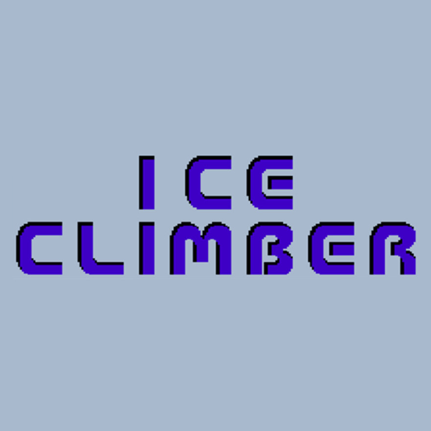

### Buenas ^^👋

Soy Gonzalo y este es mi perfil de GitHub en el que encontrarás proyectos en los que he trabajado a lo largo de mi fromación como desarrollador de videojuegos. A continuación viene un resumen de los más relevantes.

Puedes contactar conmigo a traves de:

LinkedIn: [Gonzalo Alba Durán](https://www.linkedin.com/in/gonzalo-alba-duran-b7aa50210/)  
Email: gonzaloalba96@gmail.com

# **Proyectos**

| [**YonduLib**](#yondulib) | [**0hn0**](#0hn0) | [**FlowFree**](#flowfree) | [**Off the line**](#off-the-line)| [**Ice Climbers**](#ice-climbers)|
| :-: | :-: | :-: | :-: | :-: |
| [

](#yondulib) | [

](#0hn0) | [

 ](#flowfree) | [

 ](#off-the-line) |  [

 ](#off-the-line)|

###### *Los videojuegos desarrollados son copias de los juegos originales con fines académicos.*

***

## **YonduLib**

YonduLib es un plugin para Unity que permite vincular las diferentes acciones del juego con comandos de sonido como silbar, chasquidos o golpes. Fue presentado como el Trabajo de Fin de Grado en Desarrollo de Videojuegos de la Universidad Complutense de Madrid. 

Este proyecto se apoya en el nuevo sistema de entrada [*Input System*](https://docs.unity3d.com/Packages/com.unity.inputsystem@1.0/manual/index.html) de Unity. El propio plugin proporciona una escena de prueba FPS en la que te mueves silbando y disparas chascando los dedos. Las instrucciones de cómo descargar el plugin están en el README.md del propio repositorio de [YonduLib](https://github.com/nubango/yondulib).

<a href="https://github.com/nubango/yondulib" target="_blank">**Plugin**</a>  
[**Proyecto de desarrollo**](https://github.com/nubango/yondulib-project)

***

## **0hn0**

Este proyecto es una copia del juego web 0hn0 desarrollada con fines académicos. Es un juego para móviles al estilo sudoku con diferentes nieveles de dificultad. Tiene un sistema de pistas para ayudar al jugador cuando se resuelve mal el tablero. El proyecto está desarrollado en Java utilizando Android Studio y permite la ejecución tanto para Android como para Windows.

[**Enlace a Drive**](https://drive.google.com/drive/folders/1yXF98keuLv8iFg9KiPYFmkIAtgaaKddp?usp=sharing)  
[**Repositorio**](https://github.com/gonalba/0hn0)

***

## **FlowFree**

Este proyecto es una copia del juego para móviles Flow Free desarrollada con fines académicos. El juego consiste en resolver puzzles uniendo los puntos del mismo color, distribuidos por un tablero, sin que se corten. Contiene multitud de niveles con distintas dificultades reconocibles por un código de color. Esta desarrollado en Unity con C# y la carga de mapas se realiza a través de ScriptableObjects.

[**Enlace a Drive**](https://drive.google.com/drive/folders/1IiqBSmSgq0cC2PqdO8Coid3CSISBy2_F?usp=sharing)  
[**Repositorio**](https://github.com/nubango/FlowFree)

***

## **Off the line**

Este proyecto es una copia del juego para móviles Flow Free desarrollada con fines académicos. El juego contiene 20 niveles donde tendrás que obtener todos los items para poder pasar al siguiente. El proyecto está desarrollado en Java utilizando Android Studio y permite la ejecución tanto para Android como para Windows.

[**Enlace a Drive**](https://drive.google.com/drive/folders/1AIwnG8nszKUX191Shj3mU290NJPaqWF1?usp=sharing)  
[**Repositorio**](https://github.com/nubango/videojuegos-para-dispositivos-moviles/tree/main/OffTheLine)

***
  
## **Ice Climbers**

  
Este proyecto es una versión del juego Ice Climbers desarrollada con fines académicos. Es un juego web desarrollado en JavaScript en el que controlamos al personaje Popo que tiene que ir escalando las plataformas rompiendo el hielo y evitando a los enemigos que se encuentra a su paso.

[**Web**](https://gonalba.github.io/IceClimbers/src/index.html)  
[**Repositorio**](https://github.com/gonalba/IceClimbers)

